 

  

<picture>
  <source media="(prefers-color-scheme: dark)" srcset="https://readme-typing-svg.demolab.com?font=Fira+Code&weight=600&size=19&duration=3200&pause=1200&color=A5B4FC&center=true&vCenter=true&width=750&lines=Building+scalable+full-stack+web+applications;1000%2B+DSA+problems+solved+across+platforms;Codeforces+Specialist+%7C+1400%2B+Rated;Actively+seeking+SDE+%26+Full-Stack+roles">
  <source media="(prefers-color-scheme: light)" srcset="https://readme-typing-svg.demolab.com?font=Fira+Code&weight=600&size=19&duration=3200&pause=1200&color=4338CA&center=true&vCenter=true&width=750&lines=Building+scalable+full-stack+web+applications;1000%2B+DSA+problems+solved+across+platforms;Codeforces+Specialist+%7C+1400%2B+Rated;Actively+seeking+SDE+%26+Full-Stack+roles">
  
</picture>

  

 

---

## 👨‍💻 About Me

I'm a **MERN Stack Developer** and **Competitive Programmer** who enjoys solving hard problems and shipping clean, production-ready software. I care about writing maintainable code, understanding systems deeply, and sharpening my problem-solving edge through competitive programming.

- 🔭 Building full-stack web applications with **React, Node.js, Express & MongoDB**
- 🧠 Strengthening core CS fundamentals through **DSA & System Design**
- 📈 **1000+ problems solved** across LeetCode, Codeforces, GeeksforGeeks & Coding Ninjas
- 🎯 Actively interviewing for **SDE / Full-Stack roles & internships**
- ⚡ Motto: *"First solve the problem. Then write the code."*

**What I bring to a team**

- 🧩 **Problem-solving rigor** — forged through 1000+ competitive programming problems across four platforms
- 🏗️ **End-to-end ownership** — comfortable across the full stack, from schema design to UI polish
- 📚 **Fast, independent learner** — currently leveling up in System Design, Docker, Redis & AWS on my own initiative

 

---

## 🛠️ Technical Skills

**Languages & Core**

**Frontend**

**Backend & Database**

**Tools & Platforms**

**Currently Learning**

 

---

## 🏆 Competitive Programming

| Platform | Handle | Achievement | Rating |
|:---|:---|:---|:---:|
|  | [Vikas_Gangwar](https://leetcode.com/Vikas_Gangwar) | 500+ problems solved | **1617** Max |
|  | [vikasgangwar17](https://codeforces.com/profile/vikasgangwar17) | Specialist | **1400+** |
|  | [gangwar6398](https://www.codechef.com/users/gangwar6398) | 2★ Rated Coder | 2★ |
|  | [vikasgangwar63](https://www.geeksforgeeks.org/users/vikasgangwar63) | 200+ problems solved | — |
|  | VikasGangwar | 100+ problems solved | — |

 

**Core DSA Topics**

 

---

## 🚀 Featured Projects

<picture>
  <source media="(prefers-color-scheme: dark)" srcset="https://github-readme-stats.vercel.app/api/pin/?username=officialvikas455&repo=WanderLust-1&hide_border=true&bg_color=0D1117&title_color=93C5FD&text_color=C9D1D9&icon_color=7DD3FC&border_radius=14">
  
</picture>
&nbsp;&nbsp;
<picture>
  <source media="(prefers-color-scheme: dark)" srcset="https://github-readme-stats.vercel.app/api/pin/?username=officialvikas455&repo=DSA-Solutions&hide_border=true&bg_color=0D1117&title_color=93C5FD&text_color=C9D1D9&icon_color=7DD3FC&border_radius=14">
  
</picture>

| Project | What it does |
|:---|:---|
| **[WanderLust](https://github.com/officialvikas455/WanderLust-1)** | A full-stack travel listing web app built on the MERN stack, with authentication, CRUD listings, and cloud image hosting. |
| **[DSA Solutions](https://github.com/officialvikas455/DSA-Solutions)** | A curated collection of my Data Structures & Algorithms solutions in C++, organized by topic and difficulty. |

 

---

## 📊 GitHub Analytics

<picture>
  <source media="(prefers-color-scheme: dark)" srcset="https://github-readme-stats.vercel.app/api?username=officialvikas455&show_icons=true&include_all_commits=true&count_private=true&hide_border=true&bg_color=0D1117&title_color=93C5FD&icon_color=7DD3FC&text_color=C9D1D9&border_radius=14">
  
</picture>
<picture>
  <source media="(prefers-color-scheme: dark)" srcset="https://github-readme-stats.vercel.app/api/top-langs/?username=officialvikas455&layout=compact&langs_count=8&hide_border=true&bg_color=0D1117&title_color=93C5FD&text_color=C9D1D9&border_radius=14">
  
</picture>

  

<picture>
  <source media="(prefers-color-scheme: dark)" srcset="https://streak-stats.demolab.com?user=officialvikas455&theme=dark&hide_border=true&background=0D1117&stroke=7DD3FC&ring=7DD3FC&fire=E8C170&currStreakLabel=93C5FD&sideLabels=C9D1D9&dates=8B949E&border_radius=14">
  
</picture>

  

<picture>
  <source media="(prefers-color-scheme: dark)" srcset="https://github-readme-activity-graph.vercel.app/graph?username=officialvikas455&bg_color=0D1117&color=7DD3FC&line=93C5FD&point=F8FAFC&area=true&area_color=7DD3FC&hide_border=true&radius=14">
  
</picture>

 

---

## 🏅 GitHub Trophies

<picture>
  <source media="(prefers-color-scheme: dark)" srcset="https://github-profile-trophy.vercel.app/?username=officialvikas455&theme=dark&no-frame=true&column=7&margin-w=8&margin-h=8">
  
</picture>

 

---

## 🐍 Contribution Snake

<picture>
  <source media="(prefers-color-scheme: dark)" srcset="https://raw.githubusercontent.com/officialvikas455/officialvikas455/output/github-snake-dark.svg">
  <source media="(prefers-color-scheme: light)" srcset="https://raw.githubusercontent.com/officialvikas455/officialvikas455/output/github-snake.svg">
  
</picture>

*(Appears once the included GitHub Action runs — see setup notes below)*

 

---

## 📬 Let's Connect

I'm actively looking for **SDE / Full-Stack Developer** opportunities — feel free to reach out for roles, referrals, or a chat about DSA and web development.

 

